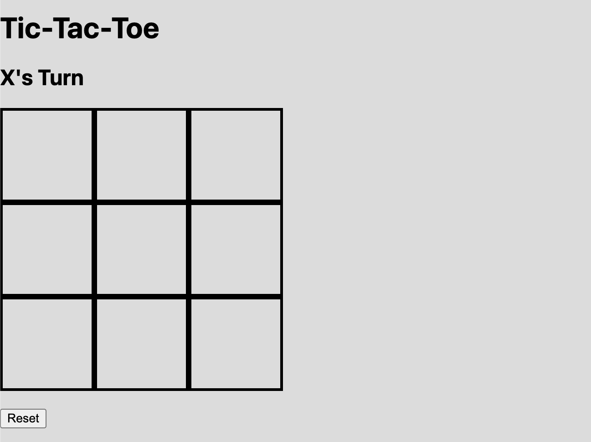
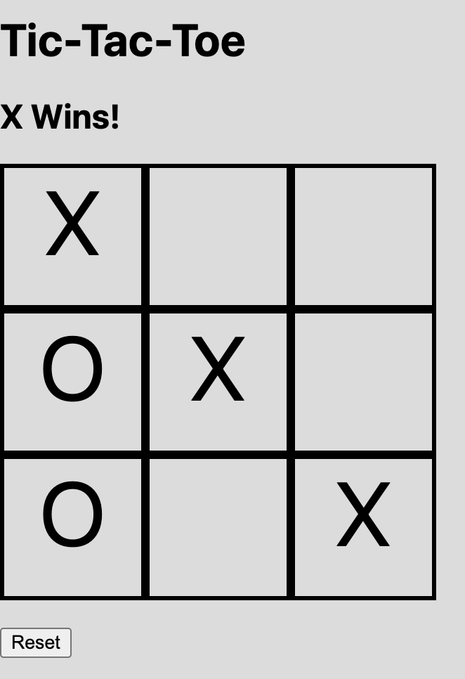

# Tic Tac Toe

## Technologies Used

* HTML
* CSS
* JavaScript
* DOM Manipulation

## Description

Tic Tac Toe is a classic two-player game built using HTML, CSS, and JavaScript. Players take turns placing **X** and **O** on a 3×3 game board. The game automatically detects winning combinations, identifies ties, updates the game status after every move, and allows players to restart the game using the reset button.

## User Stories

* As a player, I want to click on an empty square to place my symbol.
* As a player, I want turns to alternate automatically between **X** and **O**.
* As a player, I want the game to detect when someone wins.
* As a player, I want the game to detect a tie when all squares are filled without a winner.
* As a player, I want to see whose turn it is throughout the game.
* As a player, I want to restart the game at any time using the Reset button.

## Screenshots

### Game Board

### Winning Example

*(Replace these image paths with screenshots of your own project.)*

## Future Enhancements

* Add a single-player mode with an AI opponent.
* Keep track of player scores across multiple rounds.
* Highlight the winning combination.
* Add sound effects and animations.
* Allow players to customize the board and symbols.
* Make the game fully responsive for mobile devices.

## Credits

* Built as part of the General Assembly Software Engineering BootCamp.
* Inspired by the classic Tic Tac Toe game.
